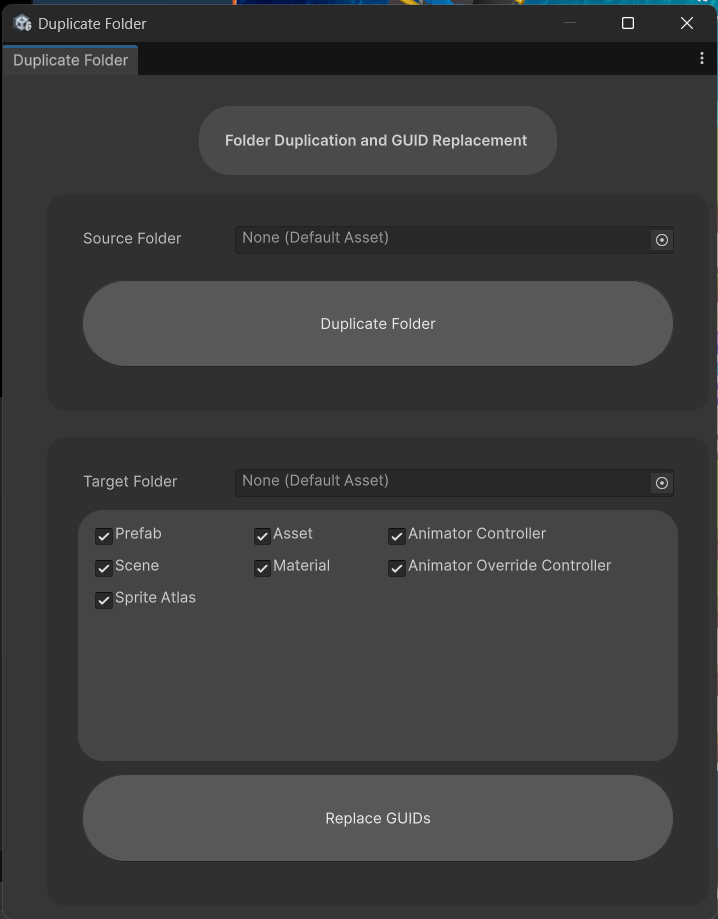
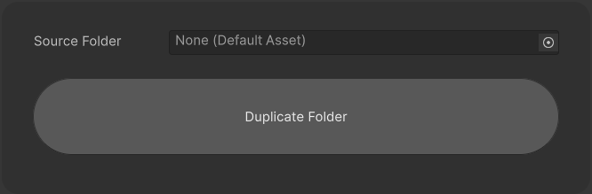
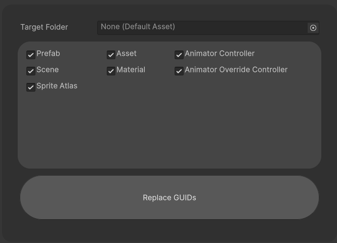

# 📂 Duplicate Folder

**Open Path:** Tools/GUIDTools/Duplicate Folder\nDescription: This is the Tool for `**Creating **`folders and `**Replacing**` it `GUID` relative to the file in the folder

> ### Example: \n\n\*\*Before\*\*

> ### Folder 1:\n— — Prefab A\n— — Prefab A Variant | parent→Prefab A\n\nFolder 1_copy:\n— — Prefab A_copy\n— — Prefab A Variant_copy | parent→`Prefab A`\n\n**\*\*After\*\***
>
> ### Folder 1:\n— — Prefab A\n— — Prefab A Variant | parent→Prefab A\n\nFolder 1_copy:\n— — Prefab A_copy\n— — Prefab A Variant_copy | parent→`Prefab A_copy`

## 1. How to Use

### 1.1 Duplicate Folder

 

**Source Folder:** Choose the Folder to Duplicate and Replace the GUID

**Duplicate Folder Button:** Duplicate the Folder in the same hierarchy as the `Source Folder` 

### 1.2 Replace GUID

 

Target Folder: This should be a folder that has just been duplicated.\nCheck Boxes: Choosing the Extension to replace the GUID\nReplace GUIDs: replace all GUIDs with the file that has the same hierarchy in the `Source Folder`

> \***Alert**\*: the `Source Folder` and the `Target Folder` need to have the same hierarchy.