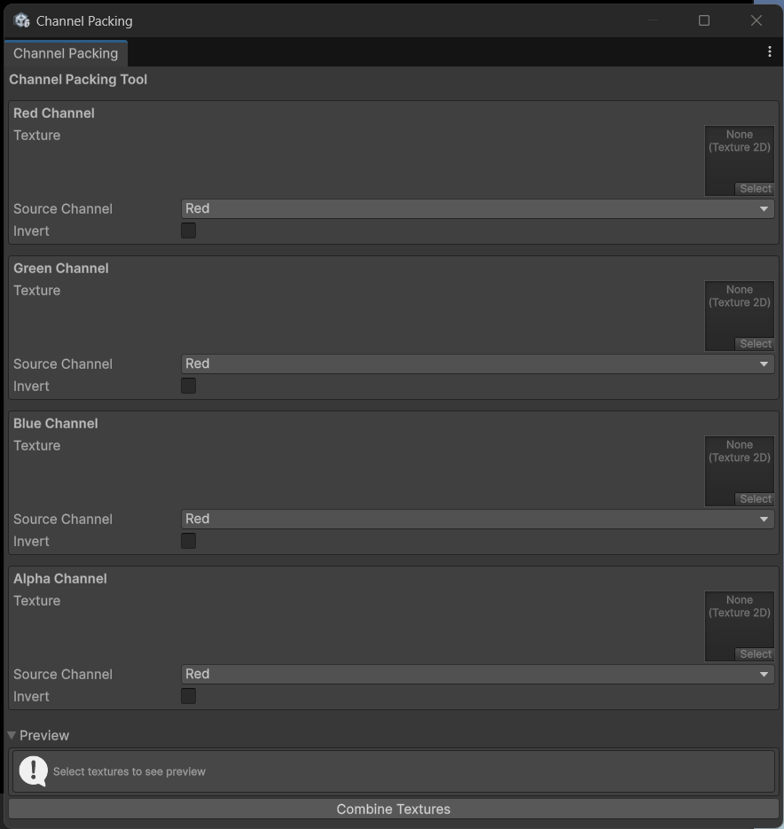

# 📦 Image Channel Packing

**Open Path:** Tools/Image Tools/Channel packing

**Description:** Pack data from 1 channel of 4 pictures into 1 picture without losing data.\n\nTexture: texture wants to pack\nSource Channel: the channel wants to pack in texture\nInvert: pack texture with inverted channel value `(1 - value)`