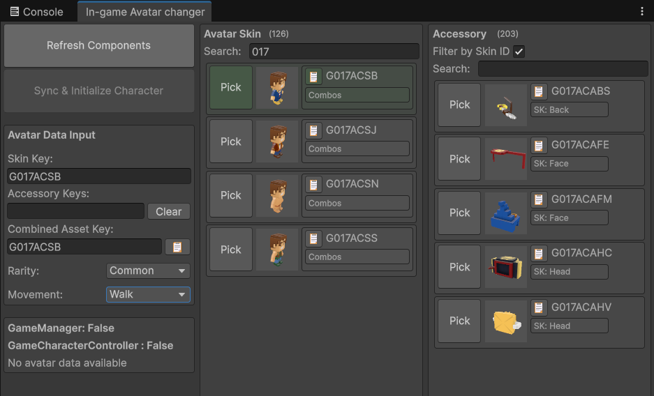
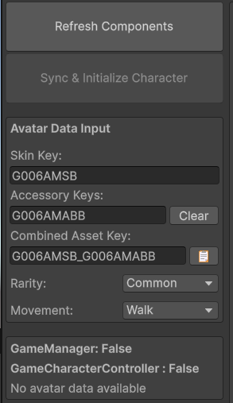
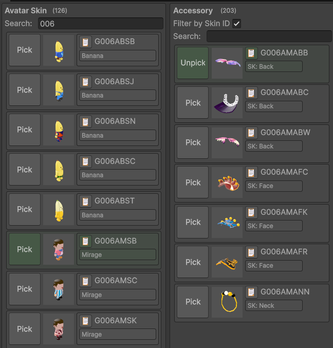

# 🥸 In-Game Avatar Changer

**Open Path:** YGG/In-game Avatar Changer\n**Description:** A Tool for changing in-game Avatars and accessories

* Change Avatar and Accessory Models
* Change Rarity (Common, Magic, Rare, Epic)
* Change Movement Type (Walk, Run, Teleporting)\n\n
* Refresh Components Button: refresh to get `GameManager` and `GameCharacterController`
* Sync & Initialize Character: Sync character code to the game

* Avatar Data Input: to contain the ID data and selected `Rarity` and `Movement`

\

\

\

\

\

 

Avatar Skin: select the Skin ID\nAccessory: select the Accessories ID\n