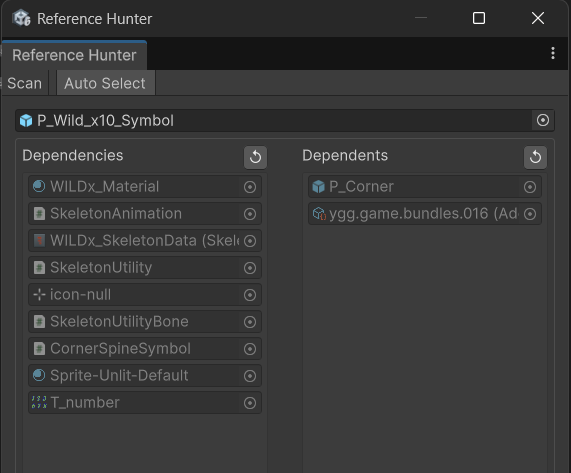
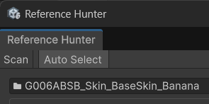

# 🔎 Reference Hunter

Open Path: Tools/GUIDTools/Reference Hunter

Description: Find Parent and Children reference inside the project (findable with asset reference)

 Scan Button: Scan the reference in the Assets Folder projects (save the cache in `CachePath`)

CachePath: Temp/

Auto Select: auto-select the object in the Project tab. show in the ObjectField below.

\
 

Child Refs: show the Child reference for the selected Object\n\nParent Refs: show the parent reference for the selected Object