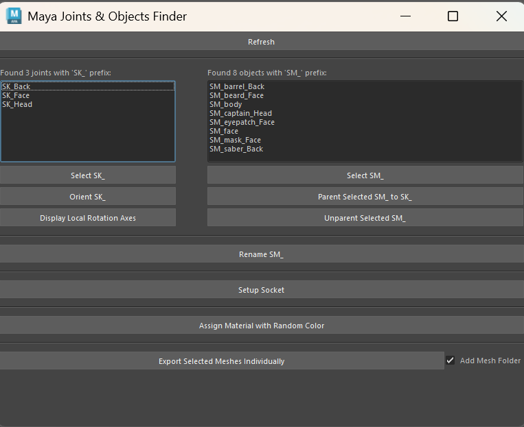

# 🦿 Socket Automation

Description: Set up and export the socket for accessories

# 1 How to use

Refresh: refresh the tool

## 1.1 Socket Panel

\n**Left Panel:** Show objects with `SK_` prefix\n**Select SK_:** Select all the objects with `SK_` prefix

**Display Local Rotation Axes:** display the bone's Rotation Axes\n

## 1.2 Mesh Panel

**Right Panel:** Show objects with `SM_` prefix\n**Select SM_:** Select all the objects with `SM_` prefix\n**Parent Selected SM_ to SK_:** Parent all the selected `SM_` Mesh to `SK_` Socket and keep the transform\nUn**parent Selected SM_ to SK_:** Unparent all the selected `SM_` Mesh to `SK_` Socket and keep the transform

## 1.3 Bottom Panel

**Rename SM_:** rename all the selected `SM_` Mesh with the selected `SK_` Socket

* get the `Name` in `SK_Name` and add it to `surfix` of the `SM_Name_surfix`

Setup Socket: Set up the `SM_` pivot and orientation to match the `SK_` bone

**Assign Material with random color:** Create a new material with random color and assign it to selected meshes

**Export select mesh:** export the mesh 

2. # Download File

[AccessorySocketSetupAutomationPremium.py 20288](attachments/5b902c60-27e1-47fc-a7d6-f32abdf4e498.false)